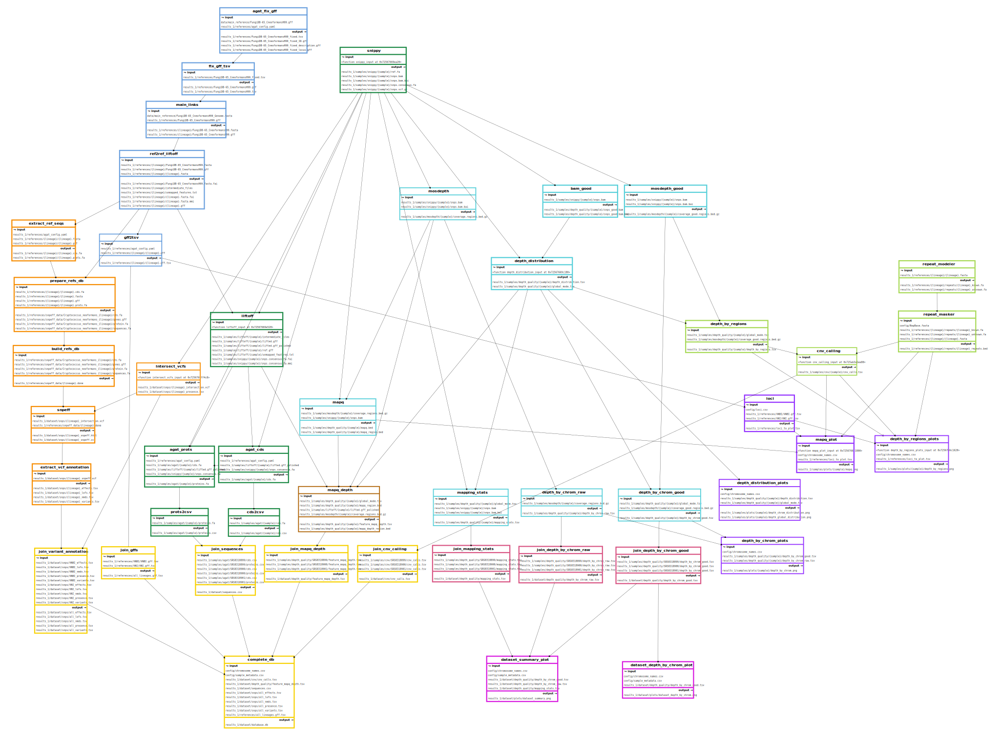

# Diversity Pipeline

## Description

This is a Snakemake workflow to map short-reads of samples to the reference genome of the corresponding lineage. You will get the mapping file, variant calling file, a reference-based assembly, and an annotation GFF. An SQL database will be created with the DNA and protein sequences, and with tables describing the presence of the called variants and their effects. Additionaly you can get analyses of the coverage and the mapping quality, plots with this analyses' results, including detection of copy-number variants, and a table with the intersection of the detected genetic variants between the samples of the same lineage.  

If you want to have a common naming scheme of your genes and/or you don't have GFF files of your reference genomes you can provide a main reference to lift over the annotation from this one to your reference genomes.

## Requirements

* Mamba/Conda [Microforge3](https://mamba.readthedocs.io/en/latest/installation/mamba-installation.html)

The environment from which the workflow must be run has the following software and you can install it with: `mamba env create --file workflow/envs/diversity.yml`
* Python
* Python modules -- [Pandas](https://pandas.pydata.org/), [Click](https://click.palletsprojects.com/en/8.1.x/), Biopython
* [Xonsh](https://xon.sh/)
* [Snakemake](https://snakemake.github.io/)
* [Graphviz](https://graphviz.org/) (optional, to see the Snakemake DAG in a graph).
* [Seqkit](https://bioinf.shenwei.me/seqkit/)

The environments for particular software used in Snakemake rules are installed by Snakemake, so you don't need to do it. If you want to install them you can run `mamba env create --file workflow/envs/envname.yaml` using the specified environment file in the table below. 

Requirements per module 
 

| Module | Software | Environment files |
| :---------------- | ----: |----: |
| Module: Annotate references|[Litoff](https://github.com/agshumate/Liftoff),[AGAT](https://github.com/NBISweden/AGAT)|`workflow/envs/liftoff.yaml`, `workflow/envs/agat.yaml`|
| Module: Main |[Snippy](https://github.com/tseemann/snippy), [Litoff](https://github.com/agshumate/Liftoff), [AGAT](https://github.com/NBISweden/AGAT)|`workflow/envs/snippy.yaml`, `workflow/envs/liftoff.yaml`, `workflow/envs/agat.yaml`|
| Module: Coverage - Quality|[Mosdepth](https://github.com/brentp/mosdepth), [Samtools](https://www.htslib.org/),[Bedtools](https://bedtools.readthedocs.io/en/latest/index.html), [RepeatMasker](https://www.repeatmasker.org/) and [RepeatModeler](https://www.repeatmasker.org/RepeatModeler/), R and R libraries -- tidyverse|`workflow/envs/depth.yaml`, `workflow/envs/samtools.yaml`, `workflow/envs/repeatmasker.yaml`, `workflow/envs/r.yaml`|
| Module: SNPs | [Samtools](https://www.htslib.org/), [Bedtools](https://bedtools.readthedocs.io/en/latest/index.html), [Bcftools](https://samtools.github.io/bcftools/bcftools.html), [Xonsh](https://xon.sh/), [Pandas](https://pandas.pydata.org/), [Click](https://click.palletsprojects.com/en/8.1.x/)|`workflow/envs/samtools.yaml`|
| Module: Plotting |[Samtools](https://www.htslib.org/), Gnuplot, matplotlib, tectonic, texlive-core, R and R libraries -- tidyverse ComplexHeatmap, svglite, scales, RColorBrewer|`workflow/envs/plot-bamstats.yaml`,`workflow/envs/r.yaml`|

## Steps to take

  * Download the code from this repository.
  * Gather your starting files (see below) and check that they are in the correct format.
  * Edit the `config/config.yaml` to match your files and desired parameters.
  * Install Mamba/Conda [Microforge3](https://mamba.readthedocs.io/en/latest/installation/mamba-installation.html)
  * Install the `diversity` enviroment: `mamba env create --file workflow/envs/diversity.yaml`
  * `conda activate diversity`
  * Run the pipeline: `snakemake --cores <n> --sdm conda -p`
    * Snakemake options:  
      * `--cores <n>`: Number of cores you want to use. Mandatory.
      * `--sdm conda`: Specify that Snakemake will use conda environments to run the rules. Mandatory.
      * `-p`: Print the command-lines run by each job in the standard output. Optional.
      * `--conda-frontend conda`: Use it if you are using conda instead of mamba. Mamba is the default.
      * `--rerun-incomplete`: Use it when a past run of the workflow was aborted and you are repeating the run.
      * `--keep-going`: Use it to avoid stoping the workflow when a job fails (i.e. run everything that can run).
      * `-n`: Dry run.  

## Structure of the working directory:    
  * `workflow/` has all the code (rules, scripts and main Snakefile), and the environment files.
  * `config/` has the file `config.yaml`(provided [here](https://github.com/magwenelab/DiversityPipeline/blob/main/config/config.yaml)) that **you must edit** to adapt to your dataset.
  * A directory of results with the name specified in `config/config.yaml` will hold all the output.
  * `logs/` will hold the log files of all runs.  
  * Additionally you need to provide the **starting files** described bellow. It's recommended to put the data files in `data/` and the tables in `config/`.

## Starting files:
  * Metadata CSV table: A comma-separated table with one sample per row. Specify the path to it in `config/config.yaml`. Mandatory columns: `sample` (sample ID used in the FASTQ file names), `lineage` (lineage or group name that associates the sample with a reference genome), `strain` (strain name, it can be the same as `sample`). If the plotting will be activated you need  one metadata column to color your samples, specify the name of this column in the `config/config.yaml`. More columns with free format are allowed. [Example](https://github.com/magwenelab/DiversityPipeline/blob/main/config/sample_metadata.csv)  
  * FASTQ files: Paired end short-read FASTQ files, one forward and one reverse file for each sample. The names of these files should be the names used in the metadata `sample` column, followed by an extension specified in the `config/config.yaml`. Files can be gzip compressed. The FASTQ files for all samples should be in the same directory (e.g., `data/samples/`, specified in the `config.yaml`).  
  * Reference genomes:    
    * If you will use reference genomes with annotation: Provide the FASTA and GFF files for each reference genome. The names of the files must be the ones in the `lineage` column of the metadata (e.g. `VNI.fasta` and `VNI.gff`). Put all the files in the same directory (e.g. `data/references`) and specify the path to it in the `config/config.yaml`.  
    * If you will use a main reference to annotate the reference genomes: Provide the FASTA file for each reference genome. The names of the files must be the ones in the `lineage` column of the metadata, e.g. `VNI.fasta`. Put all the files in the same directory (e.g. `data/references`) and specify the path to it in the `config/config.yaml`. And provide a FASTA and GFF files for the main reference, put both files in the same directory (e.g. `data/main_reference`) and specify the path to it and the names of the files in the `config/config.yaml`.   

  * `config/chromosomes.csv`: CSV with the columns `lineage`, `accession` (with the sequence ID of the chromosomes in the FASTA and GFF of the references. Make sure each chromosome ID is not repeated in this file), and `chromosome` (with the chromosome names, e.g. chr01, 1, VNI_chr1). [Example](https://github.com/magwenelab/DiversityPipeline/blob/main/config/chromosome_names.csv).
  * `config/RepBase.fasta`: Database of repetitive sequences to use for RepeatModeler and RepeatMasker in FASTA format.
  * `config/loci.csv`: If you want gene features to be plotted to the depth and MAPQ plots provide a CSV with the first column `gene_id` with the gene IDs, and the second column `feature` with the name of the feature (locus, pathway, centromere, individual gene name etc.) the gene belongs to. [Example](https://github.com/magwenelab/DiversityPipeline/blob/main/config/loci.csv)

## Output

### Processing of reference genomes

| Path | Description | Column names |
| :---------------- | ----: |----: |
| 3.References/{lineage}/{lineage}.gff
| 3.References/{lineage}/{lineage}_repeats.bed

 Intermediate files 
 

| Path | Description | Column names |
| :---------------- | ----: |----: |
| 4.Intermediate_files/3.References/all_lineages.gff.tsv
| 4.Intermediate_files/3.References/FungiDB-65_CneoformansH99_fixed_description.gff
| 4.Intermediate_files/3.References/FungiDB-65_CneoformansH99_fixed_ID.gff
| 4.Intermediate_files/3.References/FungiDB-65_CneoformansH99_fixed_locus.gff
| 4.Intermediate_files/3.References/FungiDB-65_CneoformansH99_fixed.tsv
| 4.Intermediate_files/3.References/FungiDB-65_CneoformansH99.gff
| 4.Intermediate_files/3.References/FungiDB-65_CneoformansH99.tsv
| 4.Intermediate_files/3.References/{lineage}/FungiDB-65_CneoformansH99.fasta.fai
| 4.Intermediate_files/3.References/{lineage}/FungiDB-65_CneoformansH99.gff_db
| 4.Intermediate_files/3.References/{lineage}/intermediate_liftoff/(see lifotff output)
| 4.Intermediate_files/3.References/{lineage}/liftoff.gff
| 4.Intermediate_files/3.References/{lineage}/{lineage}.cds.fa
| 4.Intermediate_files/3.References/{lineage}/{lineage}.fasta.fai
| 4.Intermediate_files/3.References/{lineage}/{lineage}.fasta.index
| 4.Intermediate_files/3.References/{lineage}/{lineage}.fasta.mmi
| 4.Intermediate_files/3.References/{lineage}/{lineage}.gff.tsv
| 4.Intermediate_files/3.References/{lineage}/{lineage}.prots.fa
| 4.Intermediate_files/3.References/{lineage}/repeats/01_simple/{lineage}.bed
| 4.Intermediate_files/3.References/{lineage}/repeats/01_simple/ (see RepeatMasker output)
| 4.Intermediate_files/3.References/{lineage}/repeats/02_complex/{lineage}.bed
| 4.Intermediate_files/3.References/{lineage}/repeats/02_complex/ (see RepeatMasker output)
| 4.Intermediate_files/3.References/{lineage}/repeats/03_known/{lineage}.bed
| 4.Intermediate_files/3.References/{lineage}/repeats/03_known/ (see RepeatMasker output)
| 4.Intermediate_files/3.References/{lineage}/repeats/04_unknown/{lineage}.bed
| 4.Intermediate_files/3.References/{lineage}/repeats/04_unknown/ (see RepeatMasker output)
| 4.Intermediate_files/3.References/{lineage}/repeats/{lineage}_db/ (see RepeatMasker output)
| 4.Intermediate_files/3.References/{lineage}/repeats/{lineage}_known.fa
| 4.Intermediate_files/3.References/{lineage}/repeats/{lineage}_unknown.fa
| 4.Intermediate_files/3.References/{lineage}/repeats/RModeler/(see RepeatModeler output)
| 4.Intermediate_files/3.References/{lineage}/unmapped_features.txt

### Snippy

| Path | Description | Column names |
| :---------------- | ----: |----: |
| 1.Samples/snippy/{sample}/snps.bam
| 1.Samples/snippy/{sample}/snps.consensus.fa
| 1.Samples/snippy/{sample}/snps.vcf
| 1.Samples/snippy/{sample}/reference/(see snippy output)
| 1.Samples/snippy/{sample}/(see snippy output)

### Depth and quality

| Path | Description | Column names |
| :---------------- | ----: |----: |
| 1.Samples/depth_quality/{sample}/mapping_stats.tsv
| 1.Samples/depth_quality/{sample}/mapq_depth_window.bed
| 2.Dataset/depth_quality/depth_by_chrom_good.tsv
| 2.Dataset/depth_quality/depth_by_chrom_raw.tsv
| 2.Dataset/depth_quality/feature_mapq_depth.tsv
| 2.Dataset/depth_quality/mapping_stats.tsv

 Intermediate files 
 

| Path | Description | Column names |
| :---------------- | ----: |----: |
| 4.Intermediate_files/1.Samples/mosdepth/{sample}/coverage_good.mosdepth.global.dist.txt
| 4.Intermediate_files/1.Samples/mosdepth/{sample}/coverage_good.mosdepth.region.dist.txt
| 4.Intermediate_files/1.Samples/mosdepth/{sample}/coverage_good.mosdepth.summary.txt
| 4.Intermediate_files/1.Samples/mosdepth/{sample}/coverage_good.regions.bed.gz
| 4.Intermediate_files/1.Samples/mosdepth/{sample}/coverage_good.regions.bed.gz.csi
| 4.Intermediate_files/1.Samples/mosdepth/{sample}/coverage.mosdepth.global.dist.txt
| 4.Intermediate_files/1.Samples/mosdepth/{sample}/coverage.mosdepth.region.dist.txt
| 4.Intermediate_files/1.Samples/mosdepth/{sample}/coverage.mosdepth.summary.txt
| 4.Intermediate_files/1.Samples/mosdepth/{sample}/coverage.regions.bed.gz
| 4.Intermediate_files/1.Samples/mosdepth/{sample}/coverage.regions.bed.gz.csi
| 4.Intermediate_files/1.Samples/depth_quality/{sample}/depth_by_chrom_good.tsv
| 4.Intermediate_files/1.Samples/depth_quality/{sample}/depth_by_chrom_raw.tsv
| 4.Intermediate_files/1.Samples/depth_quality/{sample}/depth_by_windows.tsv
| 4.Intermediate_files/1.Samples/depth_quality/{sample}/depth_distribution.tsv
| 4.Intermediate_files/1.Samples/depth_quality/{sample}/mapq.bed
| 4.Intermediate_files/1.Samples/depth_quality/{sample}/mapq_window.bed
| 4.Intermediate_files/1.Samples/depth_quality/{sample}/snps_good.bam
| 4.Intermediate_files/1.Samples/depth_quality/{sample}/snps_good.bam.bai
| 4.Intermediate_files/1.Samples/filtered_samples/{sample}.txt
| 4.Intermediate_files/2.Dataset/depth_quality/unfiltered_mapping_stats.tsv
| 4.Intermediate_files/3.References/filtered_lineages/{lineage}.txt

### Annotation

| Path | Description | Column names |
| :---------------- | ----: |----: |
| 1.Samples/annotation/{sample}/annotation.gff
| 1.Samples/annotation/{sample}/cds.fa
| 1.Samples/annotation/{sample}/proteins.fa

 Intermediate files 
 

| Path | Description | Column names |
| :---------------- | ----: |----: |
| 4.Intermediate_files/1.Samples/liftoff/{sample}/intermediate_liftoff/(see liftoff output)
| 4.Intermediate_files/1.Samples/liftoff/{sample}/lifted.gff
| 4.Intermediate_files/1.Samples/liftoff/{sample}/ref.gff_db
| 4.Intermediate_files/1.Samples/liftoff/{sample}/unmapped_features.txt
| 4.Intermediate_files/1.Samples/annotation/{sample}/cds.csv
| 4.Intermediate_files/1.Samples/annotation/{sample}/proteins.csv
| 4.Intermediate_files/2.Dataset/sequences.csv
| 4.Intermediate_files/agat_config.yaml

### SNP effects

| Path | Description | Column names |
| :---------------- | ----: |----: |
| 2.Dataset/snps/effects.tsv
| 2.Dataset/snps/lofs.tsv
| 2.Dataset/snps/nmds.tsv
| 2.Dataset/snps/presence.tsv
| 2.Dataset/snps/variants.tsv

 Intermediate files 
 

| Path | Description | Column names |
| :---------------- | ----: |----: |
| 4.Intermediate_files/2.Dataset/snps/{lineage}_effects.tsv
| 4.Intermediate_files/2.Dataset/snps/{lineage}_intersection.vcf
| 4.Intermediate_files/2.Dataset/snps/{lineage}_lofs.tsv
| 4.Intermediate_files/2.Dataset/snps/{lineage}_nmds.tsv
| 4.Intermediate_files/2.Dataset/snps/{lineage}_presence.tsv
| 4.Intermediate_files/2.Dataset/snps/{lineage}_snpeff.genes.txt
| 4.Intermediate_files/2.Dataset/snps/{lineage}_snpeff.html
| 4.Intermediate_files/2.Dataset/snps/{lineage}_snpeff.vcf
| 4.Intermediate_files/2.Dataset/snps/{lineage}_variants.tsv
| 4.Intermediate_files/3.References/snpeff_data/Cryptococcus_neoformans_{lineage}/
| 4.Intermediate_files/3.References/snpeff_data/{lineage}.done
| 4.Intermediate_files/3.References/snpeff_data/snpEff.config

### Depth and quality of genes

| Path | Description | Column names |
| :---------------- | ----: |----: |
| 1.Samples/depth_quality/{sample}/feature_mapq_depth.tsv

### CNV calling

| Path | Description | Column names |
| :---------------- | ----: |----: |
| 1.Samples/cnv/{sample}/cnv_calls.tsv
| 2.Dataset/cnv/cnv_calls.tsv

### Database

| Path | Description | Column names |
| :---------------- | ----: |----: |
| 2.Dataset/database.db

### Plots

| Path | Description |
| :---------------- | ----: |
| 1.Samples/plots/{sample}/depth_by_chrom.png
| 1.Samples/plots/{sample}/depth_by_windows.png
| 1.Samples/plots/{sample}/depth_chrom_distribution.png
| 1.Samples/plots/{sample}/depth_global_distribution.png
| 1.Samples/plots/{sample}/mapq.png
| 2.Dataset/plots/dataset_depth_by_chrom.png
| 2.Dataset/plots/dataset_summary.png

 Intermediate files 
 

| Path | Description | Column names |
| :---------------- | ----: |----: |
| 4.Intermediate_files/3.References/loci_to_plot.tsv

## Filegraph

