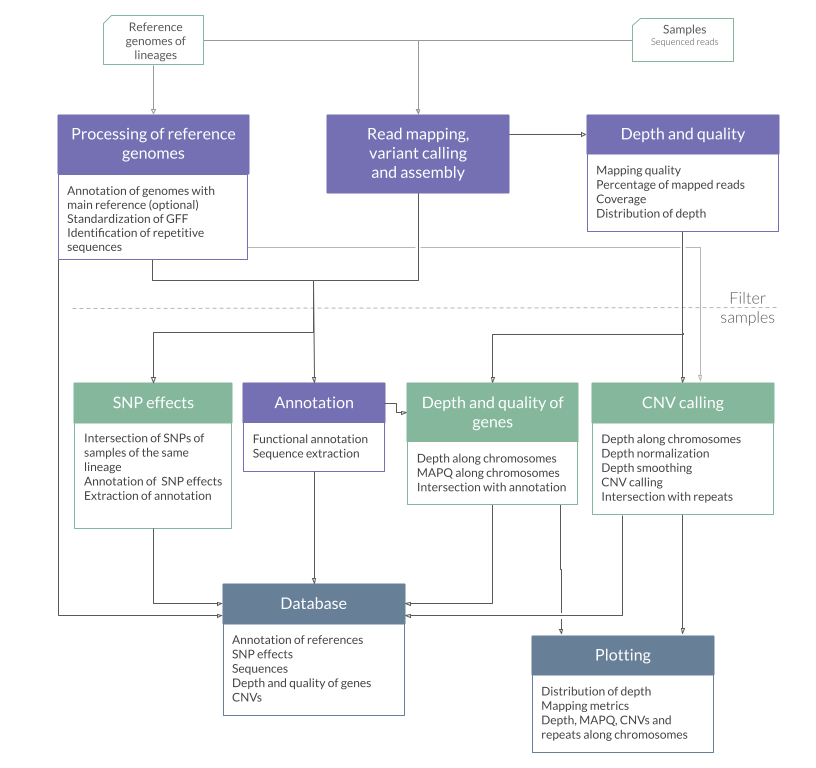
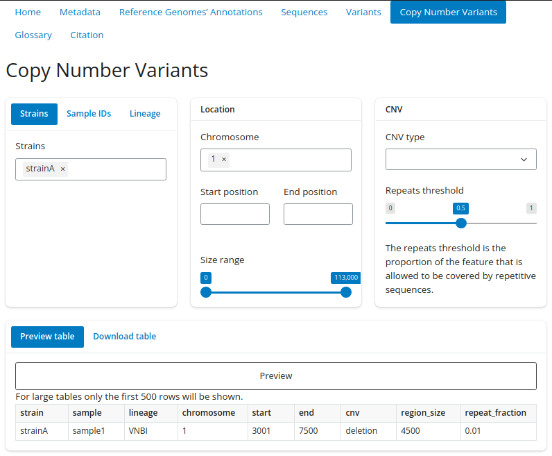

# WeavePop: Workflow to Explore and Analyze genomic Variants of Eukaryotic Populations

[](https://snakemake.readthedocs.io)

WeavePop is a [Snakemake](https://snakemake.github.io/) workflow that maps short sequencing reads of multiple haploid eukaryotic genomes to selected reference genomes and analyzes the genomic variants between them.
The core analysis is done by [Snippy](https://github.com/tseemann/snippy) to obtain alignment files (BAM), variant calling files (VCFs), and reference-based assemblies. 
From these results WeavePop analyzes the mapping quality and depth, 
annotates the assemblies with [Litoff](https://github.com/agshumate/Liftoff) using the corresponding reference genome annotation, 
extracts the DNA and amino acid sequences of all transcripts using [AGAT](https://github.com/NBISweden/AGAT), 
annotate the effects of the small variants with [SnpEff](https://pcingola.github.io/SnpEff/), 
calls Copy-Number Variants, 
generates a variety of useful diagnostic plots, 
and integrates all the results into an SQL database. 
The database is useful to easily explore the results using WeavePop-Shiny, an interactive web app, or the command-line interface WeavePop-CLI.  

Check the [Wiki](https://github.com/magwenelab/WeavePop/wiki) for detailed information on how to use WeavePop.

[Overview](#overview)  
[Installation](#installation)  
[Input files](#input-files)  
[Configuration](#configuration)  
[Testing](#testing)   
[Execution](#execution)   
[Output](#output)  
[WeavePop-Shiny](#weavepop-shiny)  

## Overview

<div style="text-align: center;">
  
</div>

## Installation

### Requirements

Requires a **Linux** operating system.

### 1. Install Conda

Install Mamba or Miniconda following the instructions from their webpage:
* Mamba: [https://github.com/conda-forge/miniforge](https://github.com/conda-forge/miniforge) (recommended)
* Miniconda: [https://docs.anaconda.com/miniconda/](https://docs.anaconda.com/miniconda/)

After successfully installing conda, add the necessary channels and set strict channel priority by running:  
```
conda config --add defaults
conda config --add conda-forge
conda config --add bioconda
conda config --set channel_priority strict
```

### 2. Download the workflow 

#### Option 1: Download this GitHub repository

Use the green button `<> Code` and click `Download ZIP`.  
Extract the `.zip` file to a directory called `WeavePop/`.

#### Option 2: Use Snakedeploy (PENDING)

### 3. Install the Snakemake Conda environment

In your terminal go to the directory you downloaded and run  
```
mamba env create --file workflow/envs/snakemake.yaml # use conda instead of mamba if you installed Miniconda
```

The environments for particular software used by the pipeline will be installed by Snakemake when you run it, so you don't need to install them. The programs in each environment are described in the table below.  
<details>
<summary>Software in the environments used in the pipeline </summary> 

|Environment files | Software | 
| ----: |----: |
|`workflow/envs/snakemake.yaml`|[Snakemake](https://snakemake.github.io/),[Python](https://www.python.org/), [Pandas](https://pandas.pydata.org/)|
|`workflow/envs/snakemake-apptainer.yaml`|[Snakemake](https://snakemake.github.io/),[Python](https://www.python.org/), [Pandas](https://pandas.pydata.org/), [Apptainer](https://apptainer.org/)|
|`workflow/envs/snippy.yaml`|[Snippy](https://github.com/tseemann/snippy),[Samtools](https://www.htslib.org/)|
|`workflow/envs/liftoff.yaml`|[Litoff](https://github.com/agshumate/Liftoff),[Minimap2]()|
|`workflow/envs/agat.yaml`|[AGAT](https://github.com/NBISweden/AGAT),[Seqkit](https://bioinf.shenwei.me/seqkit/)|
|`workflow/envs/samtools.yaml`|[Samtools](https://www.htslib.org/), [Bedtools](https://bedtools.readthedocs.io/en/latest/index.html), [Bcftools](https://samtools.github.io/bcftools/bcftools.html),[Xonsh](https://xon.sh/),[Pandas](https://pandas.pydata.org/), [Click](https://click.palletsprojects.com/en/8.1.x/), [SciPy](https://scipy.org/), [NumPy](https://numpy.org/) |
|`workflow/envs/depth.yaml`|[Mosdepth](https://github.com/brentp/mosdepth)|
|`workflow/envs/repeatmasker.yaml`|[RepeatMasker](https://www.repeatmasker.org/),[RepeatModeler](https://www.repeatmasker.org/RepeatModeler/), [Bedtools](https://bedtools.readthedocs.io/en/latest/index.html), [Seqkit](https://bioinf.shenwei.me/seqkit/)|
|`workflow/envs/r.yaml` | R, tidyverse, svglite, scales, RColorBrewer||
|`workflow/envs/variants.yaml`| [SnpEff](https://pcingola.github.io/SnpEff/),[DuckDB](https://duckdb.org/), [PyVCF](https://pyvcf.readthedocs.io/en/latest/), [Xonsh](https://xon.sh/),[Pandas](https://pandas.pydata.org/), [Click](https://click.palletsprojects.com/en/8.1.x/), [Biopython](https://biopython.org/), [Bedtools](https://bedtools.readthedocs.io/en/latest/index.html), [Bcftools](https://samtools.github.io/bcftools/bcftools.html)|
|`workflow/envs/pandas.yaml`|[Pandas](https://pandas.pydata.org/)|
|`workflow/envs/shell.yaml`|[Coreutils](https://www.gnu.org/software/coreutils/)|

</details>

## Input files
To see a full description of the input files and their format go to the [Input Wiki](https://github.com/magwenelab/WeavePop/wiki/Input-files).

* FASTQ files: Paired-end short-read FASTQ files for all samples in the same directory.  
* Reference genomes: FASTA and GFF files for each lineage. Or FASTA for each lineage and FASTA and GFF for a main reference to use to annotate the other references.
* `metadata.csv`: A comma-separated table with one sample per row, with the columns  `sample`, `lineage`, `strain`. [Example](https://github.com/magwenelab/WeavePop/blob/main/test/config/metadata.csv).  
* `chromosomes.csv`: A comma-separated table with one row per chromosome per lineage, with the columns `lineage`,`accession` and `chromosome`. [Example](https://github.com/magwenelab/WeavePop/blob/main/test/config/chromosomes.csv).  
* `RepBase.fasta`: Database of repetitive sequences in FASTA format to use for RepeatMasker. We recommend the [RepBase database](https://www.girinst.org/). You need to download it, extract the files, and concatenate them all in one FASTA file. The database is needed if the CNV, plotting, or database modules are activated. If you don't provide a database, you can choose to run it with a **fake database, which will generate inaccurate identification of repetitive sequences**.
* `loci.csv`: If you want genetic features to be plotted in the depth and MAPQ plots, provide a comma-separated table with one row per gene, with the columns `gene_id` and `feature`. Max 8 features.   [Example](https://github.com/magwenelab/WeavePop/blob/main/test/config/loci.csv).  
* `exclude.txt`: If you want to exclude from all analysis some of the samples in your metadata file you can provide a file with a list of sample IDs to exclude. 

## Configuration

To execute the workflow you need to edit the configuration file located in `config/config.yaml` to:   

* Select the workflow to run: The `analysis` workflow will run the analysis for one dataset. If you have the complete results (database module activated) of the `analysis` workflow for multiple datasets, you can use the `join_datasets` workflow to create a database with all of them.  
* Provide the paths to the input files and project directory. The working directory should be `WeavePop/`, which contains `config/` and `workflow/`.  
* Activate modules: When running the `analysis` workflow, you can select which of its modules to activate.  Activating the `database` module automatically activates the modules `cnv`, `genes_mapq_depth`, and `snpeff`.  
* Specify parameters. The output description in [Output Wiki](https://github.com/magwenelab/WeavePop/wiki/Output) explains which files are created by each module.  

To see a full description of the configuration go to the [Configuration Wiki](https://github.com/magwenelab/WeavePop/wiki/Configuration).

## Testing

```
cd /<path-to>/WeavePop/
conda activate snakemake
snakemake --profile test/config/default
```
See more details in the Wiki [Testing](https://github.com/magwenelab/WeavePop/wiki/Testing).  

## Execution

1) In a terminal go to `WeavePop/` to use as your working directory.  
2) Activate the Snakemake environment: `conda activate snakemake`.
3) Specify the command-line parameters in the execution profile `config/default/config.yaml`. 
4) Run: 
```
snakemake --profile config/default
```

Learn more about the execution options in the Wiki pages [Basic usage](https://github.com/magwenelab/WeavePop/wiki/Basic-usage), [Execution profiles](https://github.com/magwenelab/WeavePop/wiki/Execution-profiles) and [Working with multiple projects and runs](https://github.com/magwenelab/WeavePop/wiki/Working-with-multiple-projects-and-runs).

## Output

The output will be generated in the `results/` directory by default. Check the Wiki [Working with multiple projects and runs](https://github.com/magwenelab/WeavePop/wiki/Working-with-multiple-projects-and-runs). for more information.  

Here is a list of the most relevant output, to see the full list and know which module produces each file go to the [Output Wiki](https://github.com/magwenelab/WeavePop/wiki/Output).  

<details>
<summary>Output files </summary> 

| File | Description |
| :---------------- | ----: |
| `01.Samples/snippy/{sample}/snps.bam` | BAM file of alignment between short reads of the sample and the corresponding reference genome. |
| `01.Samples/snippy/{sample}/snps.consensus.fa` | FASTA file of the reference genome with all variants instantiated. |
| `01.Samples/snippy/{sample}/snps.vcf` | Called variants in VCF format. Positions are 01-Based.|
| `01.Samples/annotation/{sample}/annotation.gff` | Standardized GFF file of annotation by Liftoff. Positions are 1-Based. |
| `01.Samples/annotation/{sample}/cds.fa` | Nucleotide sequences of all transcripts of the sample. |
| `01.Samples/annotation/{sample}/proteins.fa` | Protein sequences of all isoforms of the sample. |
| `01.Samples/plots/{sample}/depth_by_windows.png` | Plot of normalized depth of windows along each chromosome, with specified genetic features, called CNVs, and repetitive sequences of the corresponding reference. |
| `02.Dataset/plots/dataset_depth_by_chrom.png` | Normalized mean depth of each chromosome in the samples that survived the quality filter.  |
| `02.Dataset/plots/dataset_summary.png` | Genome-wide depth and mapping quality metrics of the samples that survived the quality filter.|
| `02.Dataset/depth_quality/mapq_depth_by_feature.tsv` | MAPQ and mean depth of each feature in all the samples. |
| `02.Dataset/cnv/cnv_calls.tsv` | Table of deleted and duplicated regions in all samples and their overlap with repetitive sequences. Positions are 1-Based.|
| `02.Dataset/snpeff/effects.tsv`|Table with the effects of the possible variants in all lineages.|
| `02.Dataset/snpeff/lofs.tsv`|Loss of function output table of SnpEff for all lineages.|
| `02.Dataset/snpeff/nmds.tsv`|Nonsense-mediated decay output table of SnpEff for all lineages|
| `02.Dataset/snpeff/presence.tsv`|Table with the variant IDs of all lineages and the samples they are present in.|
| `02.Dataset/snpeff/variants.tsv`|Table withe the description of all variants of all lineages. Positions are 1-Based.|
| `02.Dataset/database.db` |  SQL database with the main results. |


</details>

## WeavePop-Shiny

WeavePop-Shiny is an interactive web app that allows you to query the database generated by WeavePop. It is useful to explore the results of the analysis. To use the command-line interface instead, see  [WeavePop-CLI Wiki](https://github.com/magwenelab/WeavePop/wiki/WeavePop%E2%80%90CLI).

### Installation

Install the environment with
```
mamba env create --file query_database/shiny.yaml
```

### Usage 

Go to the `02.Dataset` directory, where the `database.db` file is located.  
Activate the environment.  
Run the Shiny App.

```
cd /<path-to>/WeavePop/<my-project>/results/02.Dataset
conda activate shiny
shiny run /<path-to>/WeavePop/query_database/app.py
```
Use the app in a browser: Copy the link that appears in the output (e.g. http://127.0.0.1:8000) and paste it into your web browser. Don't close the terminal while you are using the app.  

These steps assume that you are using a local machine. If you have WeavePop and your results in a remote machine you can either download `query_database/` and the `results/02.Datasets/database.db` file and do the installation and use the WeavePop-Shiny locally, or use VSCode with the Remote extension and Shiny extension to use the WeavePop-Shiny remotely.

<div style="text-align: center;">
  
</div>


