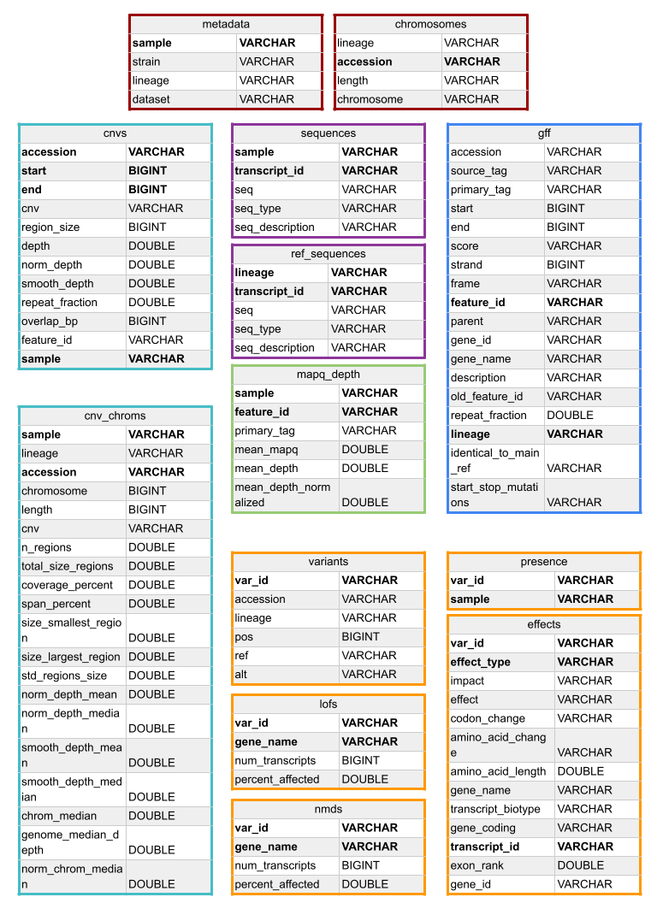
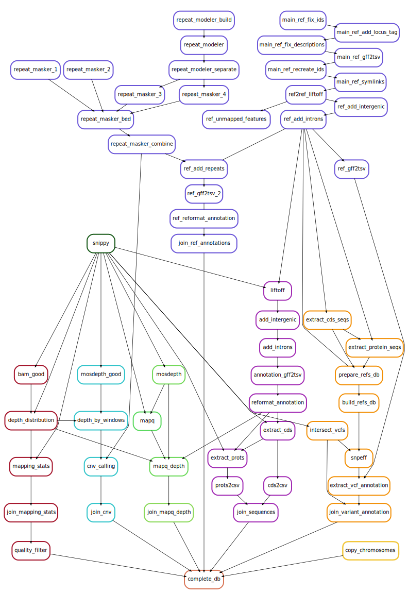

# FungalPop

[Description](#description)  
[Installation](#installation)  
[Configuration](#configuration)  
[Execution](#execution)  
[Output](#output)  
[Query the database](#query-the-database)  
[Graph of rules in the workflow](#graph-of-rules-in-the-workflow)  

## Description

FungalPop is a [Snakemake](https://snakemake.github.io/) workflow that maps short sequencing reads of multiple samples to reference genomes of the corresponding lineage. It analyzes the mapping to obtain small variants and copy-number variants between them.
The main output, generated by [Snippy](https://github.com/tseemann/snippy), is the mapping file, variant calling file, and reference-based assembly. By default, the pipeline will also analyze the mapping quality and depth, annotate the assemblies with [Litoff](https://github.com/agshumate/Liftoff) using the corresponding reference genome annotation, and extract the DNA and amino acid sequences of all transcripts using [AGAT](https://github.com/NBISweden/AGAT).  
If activated, FungalPop will also annotate the effects of the small variants, call copy-number variants, output the depth and mapping quality of each annotated feature, generate some plots, and integrate all the results into an SQL database.  
The database is useful for easily querying the results using FungalPop-Shiny, an interactive web app, or FungalPop-CLI, also provided here.  

## Installation

### Requirements

Requires a **Linux** operating system.

### Install Conda

Install Mamba or Miniconda following the instructions from their webpage:
* Mamba: [https://github.com/conda-forge/miniforge](https://github.com/conda-forge/miniforge) (recommended)
* Miniconda: [https://docs.anaconda.com/miniconda/](https://docs.anaconda.com/miniconda/)

After successfully installing conda, add the necessary channels and set strict channel priority by running  
```
conda config --add defaults
conda config --add conda-forge
conda config --add bioconda
conda config --set channel_priority strict
```

### Download the workflow 

#### Option 1: Download this GitHub repository

Use the green button `<> Code` and click `Download ZIP`.  
Extract the `.zip` file.

#### Option 2: Use Snakedeploy (PENDING)

### Install the Snakemake Conda environment

In your terminal go to the directory you downloaded and run  
```
mamba env create --file workflow/envs/snakemake.yaml # use conda instead of mamba if you installed Miniconda
```

The environments for particular software used by the pipeline will be installed by Snakemake when you run it, so you don't need to install them. The programs in each environment are described in the table below.  
<details>
<summary>Software in the environments used in the pipeline </summary> 

|Environment files | Software | 
| ----: |----: |
|`workflow/envs/snakemake.yaml`|[Snakemake](https://snakemake.github.io/),[Python](https://www.python.org/), [Pandas](https://pandas.pydata.org/), [Click](https://click.palletsprojects.com/en/8.1.x/), [Biopython](https://biopython.org/), [Xonsh](https://xon.sh/), [Graphviz](https://graphviz.org/),[Seqkit](https://bioinf.shenwei.me/seqkit/)|
|`workflow/envs/snippy.yaml`|[Snippy](https://github.com/tseemann/snippy),[Samtools](https://www.htslib.org/)|
|`workflow/envs/liftoff.yaml`|[Litoff](https://github.com/agshumate/Liftoff),[Minimap2]()|
|`workflow/envs/agat.yaml`|[AGAT](https://github.com/NBISweden/AGAT),[Seqkit](https://bioinf.shenwei.me/seqkit/)|
|`workflow/envs/samtools.yaml`|[Samtools](https://www.htslib.org/), [Bedtools](https://bedtools.readthedocs.io/en/latest/index.html), [Bcftools](https://samtools.github.io/bcftools/bcftools.html),[Xonsh](https://xon.sh/),[Pandas](https://pandas.pydata.org/), [Click](https://click.palletsprojects.com/en/8.1.x/), [SciPy](https://scipy.org/), [NumPy](https://numpy.org/) |
|`workflow/envs/depth.yaml`|[Mosdepth](https://github.com/brentp/mosdepth)|
|`workflow/envs/repeatmasker.yaml`|[RepeatMasker](https://www.repeatmasker.org/),[RepeatModeler](https://www.repeatmasker.org/RepeatModeler/), [Bedtools](https://bedtools.readthedocs.io/en/latest/index.html), [Seqkit](https://bioinf.shenwei.me/seqkit/)|
|`workflow/envs/r.yaml` | R, tidyverse, svglite, scales, RColorBrewer||
|`workflow/envs/variants.yaml`| [SnpEff](https://pcingola.github.io/SnpEff/),[DuckDB](https://duckdb.org/), [PyVCF](https://pyvcf.readthedocs.io/en/latest/), [Xonsh](https://xon.sh/),[Pandas](https://pandas.pydata.org/), [Click](https://click.palletsprojects.com/en/8.1.x/), [Biopython](https://biopython.org/), [Bedtools](https://bedtools.readthedocs.io/en/latest/index.html), [Bcftools](https://samtools.github.io/bcftools/bcftools.html)|
</details>

## Testing

To test the installation of FungalPop, run it with the included test dataset.  
The only file needed that we didn't provide is the RepBase database. 
See the Configuration and Input sections below and **run the testing when you have the RepBase database in the file `config/RepBase.fasta`**.

```
snakemake --profile config/default --configfile test/config/config.yaml &> test/test.log
```


## Configuration

To execute the workflow you need to provide input files (tables and data files) and edit the configuration file located in `config/config.yaml` to:   

* Select the workflow to run: The `analysis` workflow will run the analysis for one dataset. If you have the complete results (database module activated) of the `analysis` workflow for multiple datasets, you can use the `join_datasets` workflow to create a database with all of them.  
* Provide the paths to the input files and output directory: The config file has default paths to the input files or directories, which are relative to the working directory. The working directory should be the directory you downloaded, that contains `config/` and `workflow/`.
* Activate modules: For the `analysis` workflow, activate each module. The output description below explains which files each module creates. Activating the `database` module automatically activates the modules `cnv`, `genes_mapq_depth`, and `sniff`.  
* Specify execution parameters.  

When editing the config if you are providing a path or character strings use double quotes and no spaces inside. If you are providing a numerical parameter type only the number, no quotes. To activate a module type `True` without quotes. i.e. `activate: True`. 

### Input files

#### Tables

* `config/metadata.csv`: A comma-separated table with one sample per row. [Example](https://github.com/magwenelab/DiversityPipeline/blob/main/test/config/metadata.csv).  
Mandatory columns with these exact names:  
  * `sample`: sample ID used in the FASTQ file names (no special characters or spaces)  
  * `lineage`: lineage or group name that associates the sample with a reference genome (no special characters or spaces)  
  * `strain`: strain name (a "common name" for each sample, it can be the same as `sample` if you don't have a different one).  
If the plotting will be activated you need one metadata column to color the samples, specify the name of this column in  `metadata2color` in `config/config.yaml`. More columns with free format are allowed.   

* `config/chromosomes.csv`: A comma-separated table with one row per chromosome per lineage. [Example](https://github.com/magwenelab/DiversityPipeline/blob/main/test/config/chromosomes.csv).  
Mandatory columns with these exact names:  
  * `lineage`: Lineage name (the same as in the metadata table and the names of the reference files)  
  * `accession`: Sequence ID of the chromosomes in the FASTA and GFF of the reference of each lineage. Make sure each chromosome ID is not repeated in this file.     
  * `chromosome`: Common name of the chromosome, e.g. chr01, 1, VNI_chr01.  

* `config/RepBase.fasta`: Database of repetitive sequences in FASTA format to use for RepeatMasker. Needed if the CNV, plotting, or database modules are activated.   
We recommend the [RepBase database](https://www.girinst.org/server/RepBase/). You need to download it, extract the files, and concatenate all in one FASTA file `config/RepBase.fasta`.
```
# Update the filename to the latest version and run the following commands
wget https://www.girinst.org/server/RepBase/protected/RepBase29.01.fasta.tar.gz
tar -xvzf RepBase29.01.fasta.tar.gz
cat RepBase29.01.fasta/*.ref > RepBase.fasta
cat RepBase29.01.fasta/appendix/*.ref >> RepBase.fasta
rm -rf RepBase29.01.fasta/ RepBase29.01.fasta.tar.gz
```

* `config/loci.csv`: If you want genetic features to be plotted in the depth and MAPQ plots, provide a comma-separated table with one row per gene. [Example](https://github.com/magwenelab/DiversityPipeline/blob/main/test/config/loci.csv).  
Mandatory columns with these exact names:    
  * `gene_id`: with the gene IDs (IDs of the reference genome's GFF).  
  * `feature`: name of the feature (locus, pathway, centromere, individual gene name, etc.) the gene belongs to. Max 8 features.    

* `config/exclude.txt`: If you want to exclude from all analysis some of the samples in your metadata file you can provide a file with a list of sample names to exclude. 

#### Data

* FASTQ files (`data/samples/`): Paired-end short-read FASTQ files, one forward and one reverse file for each sample. The names of these files should be the names used in the metadata sample column, followed by an extension specified in the `config/config.yaml`. These files can be gzip compressed. The FASTQ files for all samples should be in the same directory.  
* Reference genomes:
  * `data/references/`: If you will use reference genomes with annotations: Provide the FASTA and GFF files for each reference genome. The names of the files must be the ones in the lineage column of the metadata (e.g. `VNI.fasta` and `VNI.gff`). Put all the files in the same directory.   
  * `data/references/` and `data/main_reference/`: If you want to have a common naming scheme for the genes or don't have an annotation (GFF file) of your reference genomes you can provide one annotated main reference to annotate the reference genomes' assemblies using Liftoff. For this, provide the FASTA and GFF files for the main reference, and put both files in the same directory. And provide only the FASTA file for each reference genome. The names of the files must be the ones in the lineage column of the metadata, e.g. `VNI.fasta`. Put these files in the same directory. 

## Execution
In a terminal, the working directory must be the directory with `workflow/` and `config/`.  
1) Activate the Snakemake environment: 
```
conda activate snakemake
```

2) Modify the execution configuration in `config/default/config.yaml` or `config/slurm/config.yaml`, depending on whether you want to run the workflow locally or in a SLURM cluster. To learn more about how Snakemake works, undertand its command-line options and how to take advantage of its features, you can take a look at the Wiki (PENDING).

3) Option 1 - Execute locally:
```
snakemake --profile config/default &> <mydataset>.log
```

3) Option 2 - Execute in SLURM:
```
snakemake --profile config/slurm &> <mydataset>.log
```

It is recommended to redirect all the standard output and error to a log file as shown in the example command above.
If you see an error message, identify which rule failed and check the log file for that rule. The log files are in the `logs/` directory.

## Output

Below is a description of the output produced by each module. The paths are relative to the output directory that you specified in the config file, `results/`by default.  
If you want to create all the output files you only need to activate the database and the plotting modules. If you don't want to create the database you can activate only the intermediate modules you want.
The files in bold are the ones that are integrated into the final database.  


### Processing of reference genomes

This is a required module but it has two variants. In the config file, you can activate the annotation of the reference genomes by a main reference.
The files related to repetitive sequences are created only if the CNV calling module is activated.

| Path | Description |
| :---------------- | ----: |
| `03.References/{lineage}/{lineage}_repeats.bed` | BED file of regions with repetitive sequences identified by RepeatMasker. Each region is the intersection of different types of repetitive sequences identified. Columns are Accession, Start, End, Types (comma-separated list of types in the region). Positions are 0-Based.
| `03.References/{lineage}/{lineage}.gff` | Standardized GFF file of the reference genome with added introns, intergenic regions, and repetitive sequences. If the reference annotation was activated it is the processed result of Liftoff annotation using the main reference. Positions are 1-Based.|
| `03.References/{lineage}/{lineage}.gff.tsv` | Tabular version of the previous file. Positions are 1-Based. Column names different from standard GFF format: `accession` ('seq_id'), `feature_id` ('ID'), `gene_name` ('Name'), `gene_id` ('locus'), `old_feature_id` (original ID before fixing), `lineage`, and `identical_to_main_ref`, ('matches_ref_protein', added by Liftoff if used)	`start_stop_mutation` (union of columns: 'missing_start_codon', 'missing_stop_codon', 'inframe_stop_codon' added by Liftoff if used).|
| **`03.References/all_lineages.gff.tsv`** | Concatenation of the previous table of all lineages. Positions are 1-Based. |

<details>
<summary> Intermediate files </summary> 

| Path | Description |
| :---------------- | ----: |
| `04.Intermediate_files/03.References/filtered_lineages/{lineage}.txt` | Empty file for surviving lineage after the sample filtering. |
| `04.Intermediate_files/03.References/{lineage}/intermediate_liftoff/` | See [Liftoff output](https://github.com/agshumate/Liftoff?tab=readme-ov-file#usage) |
| `04.Intermediate_files/03.References/{lineage}/repeats/01_simple/{lineage}.bed` | BED file of simple repetitive sequences. Positions are 0-Based. |
| `04.Intermediate_files/03.References/{lineage}/repeats/01_simple/` | See [RepeatMasker output](https://www.repeatmasker.org/webrepeatmaskerhelp.html)|
| `04.Intermediate_files/03.References/{lineage}/repeats/02_complex/{lineage}.bed` | BED file of complex repetitive sequences. Positions are 0-Based. |
| `04.Intermediate_files/03.References/{lineage}/repeats/02_complex/` | See [RepeatMasker output](https://www.repeatmasker.org/webrepeatmaskerhelp.html)|
| `04.Intermediate_files/03.References/{lineage}/repeats/03_known/{lineage}.bed`| BED file of known repetitive sequences. Positions are 0-Based. |
| `04.Intermediate_files/03.References/{lineage}/repeats/03_known/` | See [RepeatMasker output](https://www.repeatmasker.org/webrepeatmaskerhelp.html)|
| `04.Intermediate_files/03.References/{lineage}/repeats/04_unknown/{lineage}.bed` | BED file of unknown repetitive sequences. Positions are 0-Based. |
| `04.Intermediate_files/03.References/{lineage}/repeats/04_unknown/` | See [RepeatMasker output](https://www.repeatmasker.org/webrepeatmaskerhelp.html)|
| `04.Intermediate_files/03.References/{lineage}/repeats/db_rmodeler/` | Database created with RepeatModeler's BuildDatabase |
| `04.Intermediate_files/03.References/{lineage}/repeats/known.fa` | FASTA file of known families of repetitive sequences identified by RepeatModeler |
| `04.Intermediate_files/03.References/{lineage}/repeats/unknown.fa` | FASTA file of unknown families of repetitive sequences identified by RepeatModeler |
| `04.Intermediate_files/03.References/{lineage}/{main_reference}.fasta` | Symlink to original FASTA |
| `04.Intermediate_files/03.References/{lineage}/{main_reference}.fasta.fai` | FASTA index created by Liftoff |
| `04.Intermediate_files/03.References/{lineage}/{main_reference}.gff` | Symlink to fixed GFF |
| `04.Intermediate_files/03.References/{lineage}/{main_reference}.gff_db` | DB of GFF created by Liftoff |
| `04.Intermediate_files/03.References/{lineage}/liftoff.gff` | GFF from Liftoff before polishing |
| `04.Intermediate_files/03.References/{lineage}/liftoff.gff_polished` | GFF from Liftoff polished |
| `04.Intermediate_files/03.References/{lineage}/unmapped_features.txt` | List of features not lifted over to the reference genome |
| `04.Intermediate_files/03.References/{lineage}/{lineage}_interg_introns.gff` | `liftoff.gff_polished` plus intergenic regions and introns |
| `04.Intermediate_files/03.References/{lineage}/{lineage}_intergenic.gff` | `liftoff.gff_polished` plus intergenic regions |
| `04.Intermediate_files/03.References/{lineage}/{lineage}_repeats.gff` | `liftoff.gff_polished` plus intergenic regions, introns, and fraction of repetitive sequences |
| `04.Intermediate_files/03.References/{lineage}/{lineage}_repeats.gff.tsv` | Tabular version of the previous file |
| `04.Intermediate_files/03.References/{lineage}/{lineage}.fasta` | Symlink to original FASTA |
| `04.Intermediate_files/03.References/{lineage}/{lineage}.fasta.fai` |
| `04.Intermediate_files/03.References/{lineage}/{lineage}.fasta.mmi` |
| `04.Intermediate_files/03.References/agat_config.yaml` | Config file for AGAT |
| `04.Intermediate_files/03.References/{main_reference}_fixed_description.gff` | GFF with description tag instead of product tag|
| `04.Intermediate_files/03.References/{main_reference}_fixed_ID.gff` | GFF with fixed IDs |
| `04.Intermediate_files/03.References/{main_reference}_fixed_locus.gff` | GFF with locus tag added |
| `04.Intermediate_files/03.References/{main_reference}_fixed.tsv` | Table version of fixed_description GFF |
| `04.Intermediate_files/03.References/{main_reference}.gff` | Final fixed GFF with new IDs in the shape of `<locus>-<level2 tag and number>-<level3 tag and number>` |
| `04.Intermediate_files/03.References/{main_reference}.tsv` | TSV version of fixed GFF |

</details>


### Snippy

Allways produced.

| Path | Description |
| :---------------- | ----: |
| `01.Samples/snippy/{sample}/snps.bam` | BAM file of alignment between short reads of the sample with the corresponding reference genome. |
| `01.Samples/snippy/{sample}/snps.consensus.fa` | FASTA file of the reference genome with all variants instantiated. |
| `01.Samples/snippy/{sample}/snps.vcf` | Called variants in VCF format. Positions are 01-Based.|
| `01.Samples/snippy/{sample}/*` | Other files from the [Snippy output](https://github.com/tseemann/snippy?tab=readme-ov-file#output-files).|


### Depth and quality

Allways produced.

| Path | Description |
| :---------------- | ----: |
| `01.Samples/depth_quality/{sample}/depth_by_chrom_good.tsv` | Depth metrics of good quality mappings. Genome-wide and by chromosome (absolute and normalized). |
| `01.Samples/depth_quality/{sample}/depth_by_chrom_raw.tsv` | Depth metrics of all mappings. Genome-wide and by chromosome (absolute). |
| `01.Samples/depth_quality/{sample}/mapping_stats.tsv` | Mapping quality and depth statistics plus quality warning. | 
| `02.Dataset/depth_quality/mapping_stats.tsv` | Concatenation of `mapping_stats.tsv` files of samples that survived the quality filter. |
| **`02.Dataset/metadata.csv`** | Metadata table with samples that survived the quality filter. |
| **`02.Dataset/chromosomes.csv`** | Table of chromosome names with the lineages that survived the quality filter. |

<details>
<summary> Intermediate files </summary> 

| Path | Description |
| :---------------- | ----: |
| `04.Intermediate_files/01.Samples/depth_quality/{sample}/depth_distribution.tsv` | Distribution of read depth of good quality mappings and all mappings. |
| `04.Intermediate_files/01.Samples/depth_quality/{sample}/snps_good.bam` | Filtered BAM file with good quality mappings. |
| `04.Intermediate_files/01.Samples/depth_quality/{sample}/snps_good.bam.bai` | Index of previous file. |
| `04.Intermediate_files/01.Samples/filtered_samples/{sample}.txt` | Empty file for surviving samples after the quality filter. |
| `04.Intermediate_files/03.References/filtered_lineages/{lineage}.txt` | Empty file for surviving lineages after the sample filtering. |
| `04.Intermediate_files/02.Dataset/depth_quality/unfiltered_mapping_stats.tsv` | Concatenation of all `mapping_stats.tsv` files, before the quality filter. |


</details>

### Annotation

Allways produced.

| Path | Description |
| :---------------- | ----: |
| `01.Samples/annotation/{sample}/annotation.gff` | Standardized GFF file of annotation by Liftoff. Positions are 1-Based. |
| `01.Samples/annotation/{sample}/annotation.gff.tsv` | Tabular version of the previous file. Positions are 1-Based. Column names different from standard GFF format: `accession` ('seq_id'), `feature_id` ('ID'), `gene_name` ('Name'), `gene_id` ('locus'), `old_feature_id` (original ID before fixing), and `identical_to_main_ref`, ('matches_ref_protein') `start_stop_mutation` (union of columns: 'missing_start_codon', 'missing_stop_codon', 'inframe_stop_codon'). |
| `01.Samples/annotation/{sample}/cds.fa` | Nucleotide sequences of all transcripts of the sample. |
| `01.Samples/annotation/{sample}/proteins.fa` | Protein sequences of all isoforms of the sample. |

<details>
<summary> Intermediate files </summary> 

| Path | Description | 
| :---------------- | ----: |
| `04.Intermediate_files/01.Samples/annotation/liftoff/{sample}/` |  See [Liftoff output](https://github.com/agshumate/Liftoff?tab=readme-ov-file#usage)|
| `04.Intermediate_files/01.Samples/annotation/{sample}/intergenic.gff` | Polished GFF annotated by Liftoff with added intergenic regions. |
| `04.Intermediate_files/01.Samples/annotation/{sample}/interg_introns.gff` | Previous file with added introns. |
| `04.Intermediate_files/01.Samples/annotation/{sample}/annotation.gff.tsv` | Tabular version of previous file. |

</details>

### Depth and quality of genetic features

This files are produced if you activate this module or the database module.

| Path | Description |
| :---------------- | ----: |
| `01.Samples/depth_quality/{sample}/mapq_depth_by_feature.tsv` | MAPQ and mean depth of each feature. |
| `01.Samples/depth_quality/{sample}/mapq_depth_by_window.bed` | MAPQ and mean depth of each window. Positions are 0-Based. Columns are: accession, start, end, mean MAPQ, and mean depth. |
| **`02.Dataset/depth_quality/mapq_depth_by_feature.tsv`** | Concatenation of all `mapq_depth_by_feature.tsv` files. |


<details>
<summary> Intermediate files </summary>

| Path | Description |
| :---------------- | ----: |
| `04.Intermediate_files/01.Samples/depth_quality/{sample}/mapq.bed` | Mean MAPQ of each position. Positions are 0-Based. Columns are: accession, start, end, mean MAPQ. |
| `04.Intermediate_files/01.Samples/mosdepth/{sample}/*` |  See [Modepth](https://github.com/brentp/mosdepth) output. The files with the `_good` suffix are created in the CNV module.|
| `04.Intermediate_files/01.Samples/depth_quality/{sample}/mapq_by_window.bed` | Mean MAPQ of each window. Positions are 0-Based. Columns are: accession, start, end, mean MAPQ. |

</details>

### CNV calling

These files are produced if you activate this module, the plotting module, or the database module.

| Path | Description |
| :---------------- | ----: |
| `01.Samples/cnv/{sample}/cnv_calls.tsv` | Table of deleted and duplicated regions in each sample and their overlap with repetitive sequences. Positions are 1-Based.|
| **`02.Dataset/cnv/cnv_calls.tsv`** | Concatenation of all `cnv_calls.tsv` files.|

<details>
<summary> Intermediate files </summary>

| Path | Description |
| :---------------- | ----: |
| `04.Intermediate_files/01.Samples/depth_quality/{sample}/depth_by_windows.tsv` | Mean depth of each window. Positions are 0-Based. Columns are: accession, start, end, mean depth, normalized mean depth, and smoothed normalized mean depth.
| `04.Intermediate_files/01.Samples/mosdepth/{sample}/*` |  See [Modepth](https://github.com/brentp/mosdepth) output. The files without the `_good` suffix are created in the Depth and quality of genetic features module.|

</details>

### Annotation of SNP effects

These files are produced if you activate this module or the database module.

| Path | Description |
| :---------------- | ----: |
| **`02.Dataset/snpeff/effects.tsv`**|Concatenation of the effect tables of all lineages.|
| **`02.Dataset/snpeff/lofs.tsv`**|Concatenation of the loss of function tables of all lineages.|
| **`02.Dataset/snpeff/nmds.tsv`**|Concatenation of the nonsense-mediated decay tables of all lineages.|
| **`02.Dataset/snpeff/presence.tsv`**|Concatenation of the variant presence tables of all lineages.|
| **`02.Dataset/snpeff/variants.tsv`**|Concatenation of the variant description tables of all lineages. Positions are 1-Based.|

<details>
<summary> Intermediate files </summary> 

| Path | Description |
| :---------------- | ----: |
|`04.Intermediate_files/02.Dataset/snpeff/{lineage}_effects.tsv`| Table with the effects of the possible variants of the lineage. Identified against the annotation of the reference genome of the lineage. |
|`04.Intermediate_files/02.Dataset/snpeff/{lineage}_intersection.vcf` | VCF file with the description of all the possible variants in the lineage. The MAT field in INFO is a matrix of the presence/absence of the variant in the samples of the lineage. Positions are 1-Based.|
|`04.Intermediate_files/02.Dataset/snpeff/{lineage}_lofs.tsv`|Loss of function output table of SnpEff.|
|`04.Intermediate_files/02.Dataset/snpeff/{lineage}_nmds.tsv`|Nonsense-mediated decay output table of SnpEff.|
|`04.Intermediate_files/02.Dataset/snpeff/{lineage}_presence.tsv`|Table with the variant IDs and the samples they are present in.|
|`04.Intermediate_files/02.Dataset/snpeff/{lineage}_snpeff.genes.txt`|See [SnpEff](https://pcingola.github.io/SnpEff/) output.|
|`04.Intermediate_files/02.Dataset/snpeff/{lineage}_snpeff.html`|See [SnpEff](https://pcingola.github.io/SnpEff/) output.|
|`04.Intermediate_files/02.Dataset/snpeff/{lineage}_snpeff.vcf`| Version of the `{lineage}_intersection.vcf` annotated by SnpEff. Positions are 1-Based. |
|`04.Intermediate_files/02.Dataset/snpeff/{lineage}_variants.tsv`| Tabular version of the `{lineage}_intersection.vcf`. Positions are 1-Based.|
|`04.Intermediate_files/03.References/snpeff_data{Species_name}_{lineage}/`| Directory with the annotation database craeted by SnpEff build.|
|`04.Intermediate_files/03.References/snpeff_data/{lineage}.done`|Empty file.|
|`04.Intermediate_files/03.References/snpeff_data/snpEff.config`|Config file for SnpEff.|
|`04.Intermediate_files/03.References/{lineage}/{lineage}.cds.fa` | Nucleotide sequences of all transcripts in reference genome. |
|`04.Intermediate_files/03.References/{lineage}/{lineage}.prots.fa`| Protein sequences of all isoforms in reference genome. |
s
</details>

### Plotting

This files are produced if you activate this module.

| Path | Description |
| :---------------- | ----: |
| `01.Samples/plots/{sample}/depth_by_chrom.png` | Plot of depth metrics by chromosome and genome-wide. |
| `01.Samples/plots/{sample}/depth_by_windows.png` | Plot of normalized depth of windows along each chromosome, with specified genetic features, called CNVs, and repetitive sequences of the corresponding reference. |
| `01.Samples/plots/{sample}/depth_chrom_distribution.png` | Depth distribution by chromosome plot. |
| `01.Samples/plots/{sample}/depth_global_distribution.png` | Genome-wide depth distribution plot. |
| `01.Samples/plots/{sample}/mapq.png` | Plot of MAPQ of windows along each chromosome, with specified genetic features, called CNVs, and repetitive sequences of the corresponding reference. |
| `02.Dataset/plots/dataset_depth_by_chrom.png` | Normalized mean depth of each chromosome in the samples that survived the quality filter.  |
| `02.Dataset/plots/dataset_summary.png` | Genome-wide depth and mapping quality metrics of the samples that survived the quality filter.|

<details>
<summary> Intermediate files </summary> 

| Path | Description |
| :---------------- | ----: |
| `04.Intermediate_files/03.References/loci_to_plot.tsv` | Positions are 1-Based. |
| `04.Intermediate_files/02.Dataset/depth_quality/depth_by_chrom_good.tsv` | Concatenation of the `depth_by_chrom_good.tsv` files of the samples that survived the quality filter. |
| `04.Intermediate_files/02.Dataset/depth_quality/depth_by_chrom_raw.tsv` | Concatenation of the `depth_by_chrom_raw.tsv` files of the samples that survived the quality filter. |

</details>

### Database

Activating this module will automatically activate the CNV calling, depth and quality of genetic features, and annotation of SNP effects to integrate all the results into the file `02.Dataset/database.db`. 
This is an SQL Database created with DuckDB. It contains the tables marked in bold in the description of the output above.  
DuckDB does not require primary keys to be declared. In the schema below, when there is one variable in bold it is a unique variable, and when there are more, their combination is unique.



<details>
<summary> Intermediate files </summary>

| Path | Description |
| :---------------- | ----: |
| `04.Intermediate_files/01.Samples/annotation/{sample}/cds.csv` | Tabular version of corresponding FASTA file. |
| `04.Intermediate_files/01.Samples/annotation/{sample}/proteins.csv` | Tabular version of corresponding FASTA file. |
| **`04.Intermediate_files/02.Dataset/sequences.csv`** | Concatenation of all `cds.csv` and `proteins.csv` files. |

</details>

## Query the database

### Installation

Install the environment with
```
mamba env create --file query_database/shiny.yaml
```


### FungalPop-Shiny

Activate the environment  
```
conda activate shiny
```
Run the Shiny App  
```
shiny run app.py
```
Use the app in a browser: Copy the link that appears in the output (e.g. http://127.0.0.1:8000) and paste it into your web browser. Don't close the terminal while you are using the app.  

This steps assume that you are using a local machine. If you have FungalPop and your results in a remote machine you can either download `query_database/` and the `results/02.Datasets/database.db` file and do the installation and use the FungalPop-Shiny locally, or use VSCode with the Remote extension and Shiny extension to use the FungalPop-Shiny remotely.


### FungalPop-CLI 


FungalPop-CLI has the following commands:  
* annotation : Provides the functional annotation of all reference genomes.
* cnv : Provides the copy-number variants.
* metadata : Provides the metadata table.
* query : Query the database with a customized SQL query.
* sequences : Provides FASTA files of the sequences.
* variants : Provides the details and effects of the variants.

Activate the environment  
```
conda activate shiny
```
To know the options and available filters of each command run:  
```
python fungalpop_cli.py <command> --help
```

Examples:  
1) Get the DNA sequence of one gene of one strain:
```
python fungalpop_cli.py sequences --db ../database.db --gene_id CNAG_00001 --strain NRH5076
```
```
>NRH5076|CNAG_00001-mR1 sample=SRS8318901 gene_id=CNAG_00001 gene_name=None chromosome=13 accession=chr13_Ftc555-1
ATGGTGAGAGGGGTGGGCAAGATGGAAAGGAAAGGCTGGCGATGGAGAATATAGGGTGTG
GATGGAGAGGAGTTTGCGGATGGCTCATTTTCAATGTTCACCCTCGACTGCATCCGACTC
GACTGCATCCCACGCCGCATGCCCCATTCGAATTCGCTTTCCTCACTAGCGACTCTACAC
TCGACACTCGGCTATCCCTCAACGCCCGACGCATTTGCTCGGTTACTCCTCAACATCGCT
ACTCCTCAACATCCGACCCATCACACCCAACTCGTTCACTCTCACTCGGCTACCCCTCCA
CGCTGGCTCAACTACGCGACAGATGA
```

2) Get the CNVs of in a chromosome of a strain:
```
python fungalpop_cli.py cnv --db ../database.db  --strain NRH5084 --chromosome 1
```
```
strain  sample  lineage chromosome      start   end     cnv     region_size     repeat_fraction
NRH5084 SRS8318900      VNBI    1       1       8000    deletion        8000    0.66
NRH5084 SRS8318900      VNBI    1       2240501 2242557 deletion        2057    0.96
```

3) Make a customized query to get a table with genes with high normalized depth and save it in a file.

```
python fungalpop_cli.py query --db ../database.db --query "SELECT sample,gene_id,gene_name,mean_depth_normalized FROM mapq_depth JOIN gff ON gff.feature_id = mapq_depth.feature_id WHERE mapq_depth.primary_tag = 'gene' AND mean_depth_normalized > 5" --output high_depth_genes.tsv
```

## Graph of rules in the workflow
The activated modules in the graph are:  
Annotate references and Database.  



