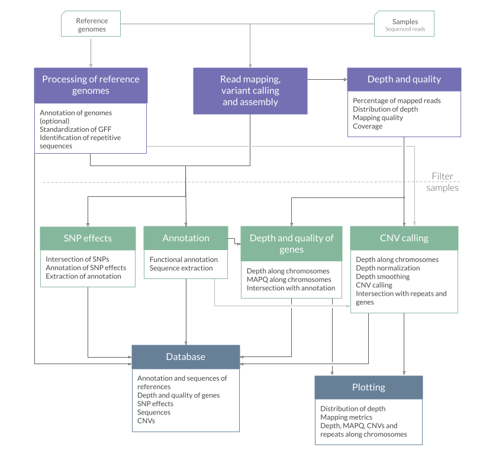

# FungalPop

[](https://snakemake.readthedocs.io)

<div style="display: flex; justify-content: space-between;">
  <div style="width: 20%;">

[Overview](#overview)  
[Installation](#installation)  
[Input files](#input-files)  
[Configuration](#configuration)  
[Testing](#testing)   
[Execution](#execution)   
[Output](#output)  
[Query the Database](#query-the-database)  

</div>
  <div style="width: 80%;">

FungalPop is a [Snakemake](https://snakemake.github.io/) workflow that maps short sequencing reads of multiple samples to reference genomes of the corresponding lineage. It analyzes the mapping to obtain small variants and copy-number variants between them.
The main output, generated by [Snippy](https://github.com/tseemann/snippy), is the mapping file, variant calling file, and reference-based assembly. By default, the pipeline will also analyze the mapping quality and depth, annotate the assemblies with [Litoff](https://github.com/agshumate/Liftoff) using the corresponding reference genome annotation, and extract the DNA and amino acid sequences of all transcripts using [AGAT](https://github.com/NBISweden/AGAT).  
If activated, FungalPop will also annotate the effects of the small variants, call copy-number variants, output the depth and mapping quality of each annotated feature, generate some plots, and integrate all the results into an SQL database.  
The database is useful for easily querying the results using FungalPop-Shiny, an interactive web app, or FungalPop-CLI, also provided here.  

Check the [Wiki](https://github.com/magwenelab/DiversityPipeline/wiki) for more detailed information on how to use FungalPop.
  </div>
</div>


## Overview


<div style="text-align: center;">
  
</div>

## Installation

### Requirements

Requires a **Linux** operating system.

### 1. Install Conda

Install Mamba or Miniconda following the instructions from their webpage:
* Mamba: [https://github.com/conda-forge/miniforge](https://github.com/conda-forge/miniforge) (recommended)
* Miniconda: [https://docs.anaconda.com/miniconda/](https://docs.anaconda.com/miniconda/)

After successfully installing conda, add the necessary channels and set strict channel priority by running:  
```
conda config --add defaults
conda config --add conda-forge
conda config --add bioconda
conda config --set channel_priority strict
```

### 2. Download the workflow 

#### Option 1: Download this GitHub repository

Use the green button `<> Code` and click `Download ZIP`.  
Extract the `.zip` file.

#### Option 2: Use Snakedeploy (PENDING)

### 3. Install the Snakemake Conda environment

In your terminal go to the directory you downloaded and run  
```
mamba env create --file workflow/envs/snakemake.yaml # use conda instead of mamba if you installed Miniconda
```

The environments for particular software used by the pipeline will be installed by Snakemake when you run it, so you don't need to install them. The programs in each environment are described in the table below.  
<details>
<summary>Software in the environments used in the pipeline </summary> 

|Environment files | Software | 
| ----: |----: |
|`workflow/envs/snakemake.yaml`|[Snakemake](https://snakemake.github.io/),[Python](https://www.python.org/), [Pandas](https://pandas.pydata.org/)|
|`workflow/envs/snakemake-apptainer.yaml`|[Snakemake](https://snakemake.github.io/),[Python](https://www.python.org/), [Pandas](https://pandas.pydata.org/), [Apptainer](https://apptainer.org/)|
|`workflow/envs/snippy.yaml`|[Snippy](https://github.com/tseemann/snippy),[Samtools](https://www.htslib.org/)|
|`workflow/envs/liftoff.yaml`|[Litoff](https://github.com/agshumate/Liftoff),[Minimap2]()|
|`workflow/envs/agat.yaml`|[AGAT](https://github.com/NBISweden/AGAT),[Seqkit](https://bioinf.shenwei.me/seqkit/)|
|`workflow/envs/samtools.yaml`|[Samtools](https://www.htslib.org/), [Bedtools](https://bedtools.readthedocs.io/en/latest/index.html), [Bcftools](https://samtools.github.io/bcftools/bcftools.html),[Xonsh](https://xon.sh/),[Pandas](https://pandas.pydata.org/), [Click](https://click.palletsprojects.com/en/8.1.x/), [SciPy](https://scipy.org/), [NumPy](https://numpy.org/) |
|`workflow/envs/depth.yaml`|[Mosdepth](https://github.com/brentp/mosdepth)|
|`workflow/envs/repeatmasker.yaml`|[RepeatMasker](https://www.repeatmasker.org/),[RepeatModeler](https://www.repeatmasker.org/RepeatModeler/), [Bedtools](https://bedtools.readthedocs.io/en/latest/index.html), [Seqkit](https://bioinf.shenwei.me/seqkit/)|
|`workflow/envs/r.yaml` | R, tidyverse, svglite, scales, RColorBrewer||
|`workflow/envs/variants.yaml`| [SnpEff](https://pcingola.github.io/SnpEff/),[DuckDB](https://duckdb.org/), [PyVCF](https://pyvcf.readthedocs.io/en/latest/), [Xonsh](https://xon.sh/),[Pandas](https://pandas.pydata.org/), [Click](https://click.palletsprojects.com/en/8.1.x/), [Biopython](https://biopython.org/), [Bedtools](https://bedtools.readthedocs.io/en/latest/index.html), [Bcftools](https://samtools.github.io/bcftools/bcftools.html)|
|`workflow/envs/pandas.yaml`|[Pandas](https://pandas.pydata.org/)|
|`workflow/envs/shell.yaml`|[Coreutils](https://www.gnu.org/software/coreutils/)|

</details>

## Input files
To see a full description of the input files and their format go to the [Input Wiki](https://github.com/magwenelab/DiversityPipeline/wiki/Input_files).

* FASTQ files (`data/samples/`): Paired-end short-read FASTQ files for all samples in the same directory.  
* Reference genomes (`data/references/`): FASTA and GFF files for each lineage. Or FASTA for each lineage and FASTA and GFF for a main reference to use to annotate the other references.
* `config/metadata.csv`: A comma-separated table with one sample per row, with the columns  `sample`, `lineage`, `strain`. [Example](https://github.com/magwenelab/DiversityPipeline/blob/main/test/config/metadata.csv).  
* `config/chromosomes.csv`: A comma-separated table with one row per chromosome per lineage, with the columns `lineage`,`accession` and `chromosome`. [Example](https://github.com/magwenelab/DiversityPipeline/blob/main/test/config/chromosomes.csv).  
* `config/RepBase.fasta`: Database of repetitive sequences in FASTA format to use for RepeatMasker. Needed if the CNV, plotting, or database modules are activated. We recommend the [RepBase database](https://www.girinst.org/server/RepBase/). You need to download it, extract the files, and concatenate all in one FASTA file `config/RepBase.fasta`.
```
# Update the filename to the latest version and run the following commands
wget https://www.girinst.org/server/RepBase/protected/RepBase29.01.fasta.tar.gz
tar -xvzf RepBase29.01.fasta.tar.gz
cat RepBase29.01.fasta/*.ref > RepBase.fasta
cat RepBase29.01.fasta/appendix/*.ref >> RepBase.fasta
rm -rf RepBase29.01.fasta/ RepBase29.01.fasta.tar.gz
```
* `config/loci.csv`: If you want genetic features to be plotted in the depth and MAPQ plots, provide a comma-separated table with one row per gene, with the columns `gene_id` and `feature`. Max 8 features.   [Example](https://github.com/magwenelab/DiversityPipeline/blob/main/test/config/loci.csv).  
* `config/exclude.txt`: If you want to exclude from all analysis some of the samples in your metadata file you can provide a file with a list of sample IDs to exclude. 

## Configuration

To execute the workflow you need edit the configuration file located in `config/config.yaml` to:   

* Select the workflow to run: The `analysis` workflow will run the analysis for one dataset. If you have the complete results (database module activated) of the `analysis` workflow for multiple datasets, you can use the `join_datasets` workflow to create a database with all of them.  
* Provide the paths to the input files and output directory: The config file has default paths to the input files or directories, which are relative to the working directory. The working directory should be the directory you downloaded, that contains `config/` and `workflow/`.
* Activate modules: For the `analysis` workflow, activate each module. The output description in [Output Wiki](https://github.com/magwenelab/DiversityPipeline/wiki/Output) explains which files each module creates. Activating the `database` module automatically activates the modules `cnv`, `genes_mapq_depth`, and `snipeff`.  
* Specify execution parameters.  

When editing the config if you are providing a path or character strings use double quotes and no spaces inside. If you are providing a numerical parameter type only the number, no quotes. To activate a module type `True` without quotes. i.e. `activate: True`. 

## Testing

To test the installation of FungalPop, run it with the included test dataset.  
The only file needed that we didn't provide is the RepBase database. 
See the Configuration and Input sections above and **run the testing when you have the RepBase database in the file `config/RepBase.fasta`**.

```
conda activate snakemake
snakemake --profile config/default --configfile test/config/config.yaml &> test/test.log
```

## Execution
To learn more about how Snakemake works, undertand its command-line options and how to take advantage of its features, you can take a look at the [Wiki](https://github.com/magwenelab/DiversityPipeline/wiki).

In a terminal, the working directory must be the directory with `workflow/` and `config/`.  
1) Activate the Snakemake environment: 
```
conda activate snakemake
```

2) Modify the execution configuration in `config/default/config.yaml` or `config/slurm/config.yaml`, depending on whether you want to run the workflow locally or in a SLURM cluster. 

3) Option 1 - Execute locally:
```
snakemake --profile config/default &> <mydataset>.log
```

3) Option 2 - Execute in SLURM:
```
snakemake --profile config/slurm &> <mydataset>.log
```

It is recommended to redirect all the standard output and error to a log file as shown in the example command above.
If you see an error message, identify which rule failed and check the log file for that rule. The log files are in the `logs/` directory.

## Output

Here is a list of the most relevant output, to see the full list and know which module produces each file go to the [Output Wiki](https://github.com/magwenelab/DiversityPipeline/wiki/Output).  


| File | Description |
| :---------------- | ----: |
| `01.Samples/snippy/{sample}/snps.bam` | BAM file of alignment between short reads of the sample with the corresponding reference genome. |
| `01.Samples/snippy/{sample}/snps.consensus.fa` | FASTA file of the reference genome with all variants instantiated. |
| `01.Samples/snippy/{sample}/snps.vcf` | Called variants in VCF format. Positions are 01-Based.|
| `01.Samples/annotation/{sample}/annotation.gff` | Standardized GFF file of annotation by Liftoff. Positions are 1-Based. |
| `01.Samples/annotation/{sample}/cds.fa` | Nucleotide sequences of all transcripts of the sample. |
| `01.Samples/annotation/{sample}/proteins.fa` | Protein sequences of all isoforms of the sample. |
| **`02.Dataset/depth_quality/mapq_depth_by_feature.tsv`** | MAPQ and mean depth of each feature in all the samples. |
| **`02.Dataset/cnv/cnv_calls.tsv`** | Table of deleted and duplicated regions in all samples and their overlap with repetitive sequences. Positions are 1-Based.|
| **`02.Dataset/snpeff/effects.tsv`**|Table with the effects of the possible variants in all lineages.|
| **`02.Dataset/snpeff/lofs.tsv`**|Loss of function output table of SnpEff for all lineages.|
| **`02.Dataset/snpeff/nmds.tsv`**|Nonsense-mediated decay output table of SnpEff for all lineages|
| **`02.Dataset/snpeff/presence.tsv`**|Table with the variant IDs of all lineages and the samples they are present in.|
| **`02.Dataset/snpeff/variants.tsv`**|Table withe the description of all variants of all lineages. Positions are 1-Based.|
| `02.Dataset/database.db` |  | SQLite database with the tables marked in bold. |
| `01.Samples/plots/{sample}/depth_by_chrom.png` | Plot of depth metrics by chromosome and genome-wide. |
| `01.Samples/plots/{sample}/depth_by_windows.png` | Plot of normalized depth of windows along each chromosome, with specified genetic features, called CNVs, and repetitive sequences of the corresponding reference. |
| `01.Samples/plots/{sample}/depth_chrom_distribution.png` | Depth distribution by chromosome plot. |
| `01.Samples/plots/{sample}/depth_global_distribution.png` | Genome-wide depth distribution plot. |
| `01.Samples/plots/{sample}/mapq.png` | Plot of MAPQ of windows along each chromosome, with specified genetic features, called CNVs, and repetitive sequences of the corresponding reference. |
| `02.Dataset/plots/dataset_depth_by_chrom.png` | Normalized mean depth of each chromosome in the samples that survived the quality filter.  |
| `02.Dataset/plots/dataset_summary.png` | Genome-wide depth and mapping quality metrics of the samples that survived the quality filter.|

## Query the Database

### Installation

Install the environment with
```
mamba env create --file query_database/shiny.yaml
```

### Usage FungalPop-Shiny

Go to the `02.Dataset` directory, where the `database.db` file is located.  
Activate the environment.  
Run the Shiny App.

```
cd /<path-to>/FungalPop/<my-project>/results/02.Dataset
conda activate shiny
shiny run /<path-to>/FungalPop/query_database/app.py
```
Use the app in a browser: Copy the link that appears in the output (e.g. http://127.0.0.1:8000) and paste it into your web browser. Don't close the terminal while you are using the app.  

This steps assume that you are using a local machine. If you have FungalPop and your results in a remote machine you can either download `query_database/` and the `results/02.Datasets/database.db` file and do the installation and use the FungalPop-Shiny locally, or use VSCode with the Remote extension and Shiny extension to use the FungalPop-Shiny remotely.

<div style="text-align: center;">
  
</div>

### Usage FungalPop-CLI 

FungalPop-CLI has the following commands:  
* annotation : Provides the functional annotation of all reference genomes.
* cnv : Provides the copy-number variants.
* metadata : Provides the metadata table.
* query : Query the database with a customized SQL query.
* sequences : Provides FASTA files of the sequences.
* variants : Provides the details and effects of the variants.

Activate the environment  
```
conda activate shiny
```
To know the options and available filters of each command run:  
```
python fungalpop_cli.py <command> --help
```

Examples:  
1) Get the DNA sequence of one gene of one strain:
```
python fungalpop_cli.py sequences --db ../database.db --gene_id CNAG_00001 --strain NRH5076
```
```
>NRH5076|CNAG_00001-mR1 sample=SRS8318901 gene_id=CNAG_00001 gene_name=None chromosome=13 accession=chr13_Ftc555-1
ATGGTGAGAGGGGTGGGCAAGATGGAAAGGAAAGGCTGGCGATGGAGAATATAGGGTGTG
GATGGAGAGGAGTTTGCGGATGGCTCATTTTCAATGTTCACCCTCGACTGCATCCGACTC
GACTGCATCCCACGCCGCATGCCCCATTCGAATTCGCTTTCCTCACTAGCGACTCTACAC
TCGACACTCGGCTATCCCTCAACGCCCGACGCATTTGCTCGGTTACTCCTCAACATCGCT
ACTCCTCAACATCCGACCCATCACACCCAACTCGTTCACTCTCACTCGGCTACCCCTCCA
CGCTGGCTCAACTACGCGACAGATGA
```

2) Get the CNVs of in a chromosome of a strain:
```
python fungalpop_cli.py cnv --db ../database.db  --strain NRH5084 --chromosome 1
```
```
strain  sample  lineage chromosome      start   end     cnv     region_size     repeat_fraction
NRH5084 SRS8318900      VNBI    1       1       8000    deletion        8000    0.66
NRH5084 SRS8318900      VNBI    1       2240501 2242557 deletion        2057    0.96
```

3) Make a customized query to get a table with genes with high normalized depth and save it in a file.

```
python fungalpop_cli.py query --db ../database.db --query "SELECT sample,gene_id,gene_name,mean_depth_normalized FROM mapq_depth JOIN gff ON gff.feature_id = mapq_depth.feature_id WHERE mapq_depth.primary_tag = 'gene' AND mean_depth_normalized > 5" --output high_depth_genes.tsv
```

